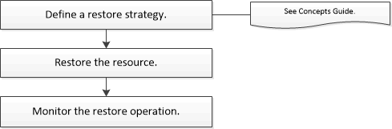

= 워크플로 복원
:allow-uri-read: 
:icons: font
:imagesdir: ../media/

[role="lead"]
SnapCenter 사용하면 활성 파일 시스템에 하나 이상의 백업을 복원하여 Exchange 데이터베이스를 복원할 수 있습니다.

다음 워크플로는 Exchange 데이터베이스 복원 작업을 수행해야 하는 순서를 보여줍니다.

PowerShell cmdlet을 수동으로 또는 스크립트로 사용하여 백업 및 복원 작업을 수행할 수도 있습니다.  PowerShell cmdlet에 대한 자세한 내용은 SnapCenter cmdlet 도움말을 사용하거나 다음을 참조하세요. https://docs.netapp.com/us-en/snapcenter-cmdlets/index.html["SnapCenter 소프트웨어 Cmdlet 참조 가이드"^] .
