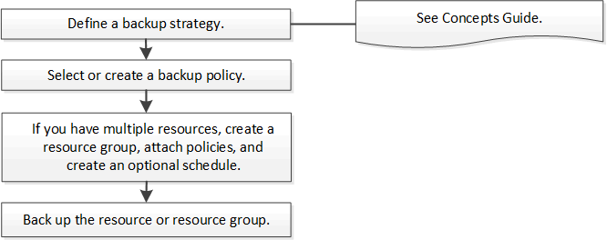

= 백업 워크플로
:allow-uri-read: 
:icons: font
:imagesdir: ../media/

[role="lead"]
사용자 환경에 Microsoft SQL Server용 SnapCenter 플러그인을 설치하면 SnapCenter 사용하여 SQL Server 리소스를 백업할 수 있습니다.

여러 서버에서 동시에 실행되도록 여러 백업을 예약할 수 있습니다.

동일한 리소스에서 백업 및 복원 작업을 동시에 수행할 수 없습니다.

다음 워크플로는 백업 작업을 수행해야 하는 순서를 보여줍니다.

NOTE: 리소스 페이지에서 지금 백업, 복원, 백업 관리 및 복제 옵션은 NetApp LUN이 아닌 LUN, 손상된 데이터베이스 또는 복원 중인 데이터베이스를 선택하는 경우 비활성화됩니다.

PowerShell cmdlet을 수동으로 또는 스크립트로 사용하여 백업, 복원, 복구, 확인 및 복제 작업을 수행할 수도 있습니다.  PowerShell cmdlet에 대한 자세한 내용은 SnapCenter cmdlet 도움말을 사용하거나 다음을 참조하세요. https://docs.netapp.com/us-en/snapcenter-cmdlets/index.html["SnapCenter 소프트웨어 Cmdlet 참조 가이드"]

== SnapCenter 데이터베이스를 백업하는 방법

SnapCenter 스냅샷 기술을 사용하여 LUN이나 VMDK에 있는 SQL Server 데이터베이스를 백업합니다.  SnapCenter 데이터베이스의 스냅샷을 만들어 백업을 생성합니다.

리소스 페이지에서 전체 데이터베이스 백업을 위한 데이터베이스를 선택하면 SnapCenter 동일한 스토리지 볼륨에 있는 다른 모든 데이터베이스를 자동으로 선택합니다.  LUN이나 VMDK가 단일 데이터베이스만 저장하는 경우 데이터베이스를 개별적으로 지우거나 다시 선택할 수 있습니다.  LUN이나 VMDK에 여러 데이터베이스가 있는 경우 해당 데이터베이스를 그룹으로 지우거나 다시 선택해야 합니다.

단일 볼륨에 있는 모든 데이터베이스는 스냅샷을 사용하여 동시에 백업됩니다.  동시 백업 데이터베이스의 최대 수가 35이고, 스토리지 볼륨에 35개가 넘는 데이터베이스가 있는 경우 생성되는 스냅샷의 총 수는 데이터베이스 수를 35로 나눈 값과 같습니다.

NOTE: 백업 정책에서 각 스냅샷에 대한 최대 데이터베이스 수를 구성할 수 있습니다.

SnapCenter 스냅샷을 생성하면 전체 스토리지 시스템 볼륨이 스냅샷에 캡처됩니다.  하지만 백업은 백업이 생성된 SQL 호스트 서버에만 유효합니다.

다른 SQL 호스트 서버의 데이터가 동일한 볼륨에 있는 경우, 이 데이터는 스냅샷에서 복원할 수 없습니다.

*더 많은 정보를 찾아보세요*

link:https://kb.netapp.com/Advice_and_Troubleshooting/Data_Protection_and_Security/SnapCenter/Quiesce_or_grouping_resources_operations_fail["정지 또는 리소스 그룹화 작업이 실패합니다."]
