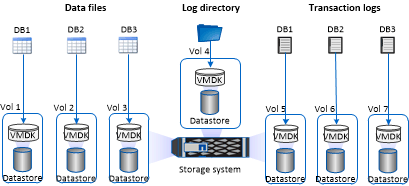

= Microsoft SQL Server용 SnapCenter 플러그인에 대한 스토리지 레이아웃 권장 사항
:allow-uri-read: 
:icons: font
:imagesdir: ../media/

[role="lead"]
잘 설계된 스토리지 레이아웃을 통해 SnapCenter Server는 복구 목표를 충족하도록 데이터베이스를 백업할 수 있습니다.  저장소 레이아웃을 정의할 때는 데이터베이스 크기, 데이터베이스 변경률, 백업 빈도 등 여러 요소를 고려해야 합니다.

다음 섹션에서는 사용자 환경에 설치된 Microsoft SQL Server용 SnapCenter 플러그인을 사용하여 LUN 및 가상 머신 디스크(VMDK)에 대한 스토리지 레이아웃 권장 사항과 제한 사항을 정의합니다.

이 경우 LUN에는 게스트에 매핑된 VMware RDM 디스크와 iSCSI 직접 연결 LUN이 포함될 수 있습니다.

== LUN 및 VMDK 요구 사항

최적의 성능과 다음 데이터베이스 관리를 위해 전용 LUN이나 VMDK를 선택적으로 사용할 수 있습니다.

* 마스터 및 모델 시스템 데이터베이스
* Tempdb
* 사용자 데이터베이스 파일(.mdf 및 .ndf)
* 사용자 데이터베이스 트랜잭션 로그 파일(.ldf)
* 로그 디렉토리

대규모 데이터베이스를 복원하려면 전용 LUN이나 VMDK를 사용하는 것이 가장 좋습니다.  전체 LUN 또는 VMDK를 복원하는 데 걸리는 시간은 LUN 또는 VMDK에 저장된 개별 파일을 복원하는 데 걸리는 시간보다 짧습니다.

로그 디렉토리의 경우 데이터 또는 로그 파일 디스크에 충분한 여유 공간이 있도록 별도의 LUN이나 VMDK를 만들어야 합니다.

== LUN 및 VMDK 샘플 레이아웃

다음 그래픽은 LUN에서 대규모 데이터베이스에 대한 스토리지 레이아웃을 구성하는 방법을 보여줍니다.

image::../media/smsql_storage_layout_mult_vols_snapcenter.gif[여러 LUN 다이어그램]

다음 그래픽은 LUN에서 중소형 데이터베이스에 대한 스토리지 레이아웃을 구성하는 방법을 보여줍니다.

image::../media/smsql_storage_layout_mult_dbs_luns_snapcenter.gif[LUN당 여러 데이터베이스 다이어그램]

다음 그래픽은 VMDK에서 대규모 데이터베이스에 대한 스토리지 레이아웃을 구성하는 방법을 보여줍니다.

다음 그래픽은 VMDK에서 중소형 데이터베이스의 스토리지 레이아웃을 구성하는 방법을 보여줍니다.

image::../media/smsql_storage_layout_med_small_dbs_vmdk.gif[VMDK의 중소 규모 데이터베이스를 위한 스토리지 레이아웃]
